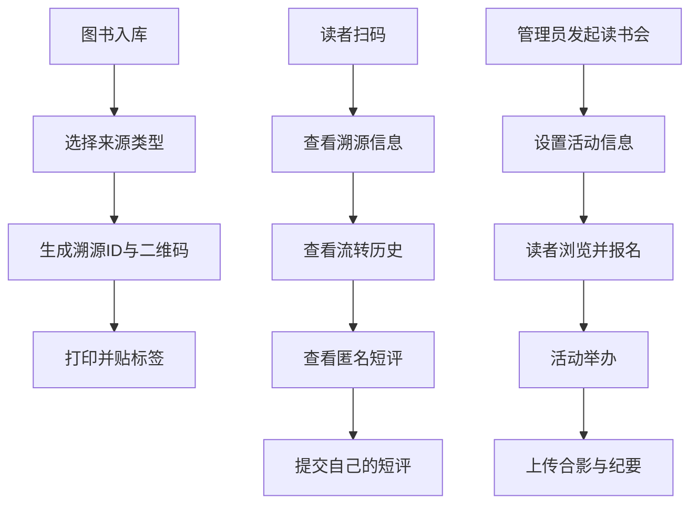

## 1. 产品概述

独立书店图书溯源与线下读书会管理平台，为独立书店提供图书全生命周期溯源管理与线下读书会运营服务。

- 核心价值：为每本图书建立独一无二的溯源档案，让读者感受书籍流转的温度；帮助书店高效运营线下读书会，构建读者社群
- 目标用户：独立书店经营者、书店会员/读者

## 2. 核心功能

### 2.1 用户角色
| 角色 | 注册方式 | 核心权限 |
|------|----------|----------|
| 书店管理员 | 后台账号登录 | 图书入库管理、库存管理、读书会发起与管理、数据统计查看 |
| 读者用户 | 扫码/浏览访问 | 查看图书溯源信息、发表匿名短评、报名读书会活动 |

### 2.2 功能模块
1. **首页仪表盘**：图书热度排行榜、近期读书会活动、库存概览
2. **图书溯源模块**：图书入库、二维码生成、溯源查询、流转历史、匿名短评
3. **读书会模块**：活动发起、报名管理、活动回顾上传
4. **库存管理模块**：图书列表、分类筛选、来源统计

### 2.3 页面详情
| 页面名称 | 模块名称 | 功能描述 |
|----------|----------|----------|
| 首页仪表盘 | 数据概览 | 库存数量统计、图书热度排行Top10、近期读书会列表 |
| 图书入库 | 入库表单 | 录入图书信息、选择来源类型（捐赠/直供/回收）、自动生成溯源二维码 |
| 图书详情 | 溯源展示 | 显示书籍基本信息、流转历史时间线、前任读者匿名短评列表、添加短评 |
| 库存管理 | 图书列表 | 分页展示所有图书、按来源/分类筛选、搜索、查看详情 |
| 读书会列表 | 活动卡片 | 展示所有读书会、状态筛选、报名按钮、查看详情 |
| 读书会详情 | 活动详情 | 活动信息、报名人数、报名表单、合影展示、讨论纪要 |
| 发起读书会 | 活动表单 | 填写活动主题、时间地点、人数上限、推荐书籍、活动描述 |
| 扫码页面 | 溯源查询 | 展示扫码结果、图书溯源信息、匿名短评 |

## 3. 核心流程

**图书入库流程**：书店管理员录入图书信息 → 选择来源类型 → 系统生成唯一溯源ID与二维码 → 打印二维码标签 → 贴于书籍

**读者扫码流程**：读者扫描图书二维码 → 系统展示图书基本信息 → 展示流转历史时间线 → 展示前任读者匿名短评 → 读者可提交自己的短评

**读书会流程**：管理员发起活动 → 设置主题、时间、地点、人数上限 → 读者浏览活动列表 → 读者报名（受人数限制）→ 活动结束后管理员上传合影与讨论纪要

## 4. 用户界面设计

### 4.1 设计风格
- **主色调**：温暖的咖啡色 `#6F4E37`，代表书香与独立书店的人文气息
- **辅助色**：米白色 `#F5F0E8` 背景、古铜金 `#B8860B` 点缀、墨绿色 `#2E5339` 辅助
- **按钮风格**：圆角设计（8px），悬浮时微上浮+阴影加深
- **字体**：标题使用"Noto Serif SC"衬线体体现文化感，正文使用"Noto Sans SC"无衬线体保证可读性
- **布局风格**：卡片式布局 + 留白充足的编辑类排版
- **图标风格**：Lucide 图标库，线性风格

### 4.2 页面设计概述
| 页面名称 | 模块名称 | UI元素 |
|----------|----------|--------|
| 首页仪表盘 | 数据概览 | 渐变统计卡片、排行榜样式、活动时间线卡片、暖色调背景纹理 |
| 图书入库 | 入库表单 | 分组表单、来源类型标签切换、二维码预览弹窗、雅致阴影 |
| 图书详情 | 溯源展示 | 时间线组件、书籍封面大图、短评卡片瀑布流、悬浮动效 |
| 库存管理 | 图书列表 | 筛选标签栏、图书卡片网格、搜索框、分页组件 |
| 读书会列表 | 活动卡片 | 活动封面图、状态徽章、报名进度条、悬停翻转动效 |
| 读书会详情 | 活动详情 | 信息分区卡片、报名表单、相册网格、纪要富文本展示 |
| 发起读书会 | 活动表单 | 分步表单、人数选择器、日期时间选择器 |

### 4.3 响应式设计
桌面端优先设计（≥1280px），自适应至平板（768px-1279px）和移动端（<768px），触摸操作优化。
