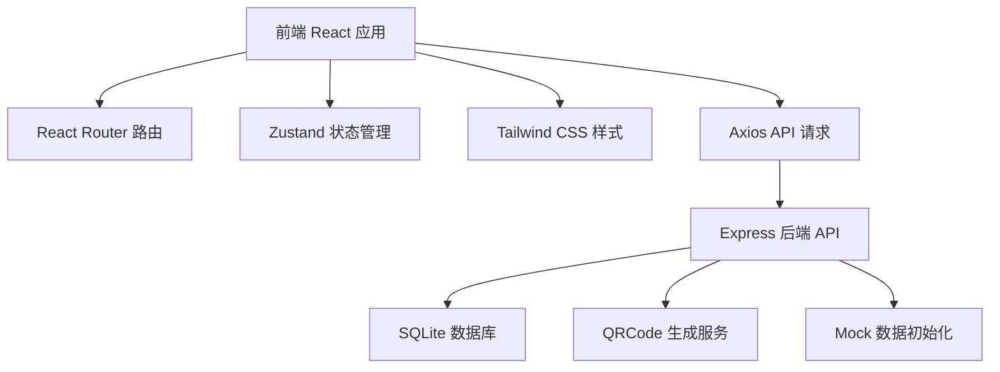
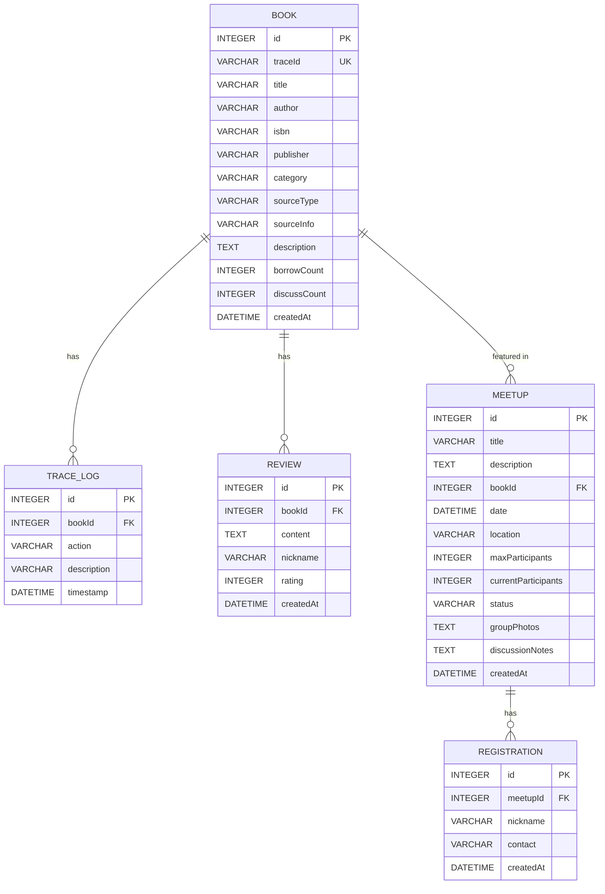

## 1. 架构设计



## 2. 技术描述
- **前端**：React@18 + TypeScript + TailwindCSS@3 + Vite
- **状态管理**：Zustand
- **路由**：React Router DOM
- **图标**：Lucide React
- **二维码**：qrcode 库
- **后端**：Express@4 + TypeScript
- **数据库**：better-sqlite3（轻量级嵌入式数据库，适合单书店场景）
- **初始化工具**：vite-init（react-express-ts 模板）

## 3. 路由定义
| 前端路由 | 页面组件 | 用途 |
|----------|----------|------|
| / | Dashboard | 首页仪表盘 |
| /books | BookList | 库存管理/图书列表 |
| /books/new | BookAdd | 图书入库 |
| /books/:id | BookDetail | 图书详情（溯源信息） |
| /trace/:traceId | TraceView | 扫码溯源页面 |
| /meetups | MeetupList | 读书会列表 |
| /meetups/new | MeetupCreate | 发起读书会 |
| /meetups/:id | MeetupDetail | 读书会详情 |

## 4. API 定义

### 4.1 图书相关
```typescript
// 图书类型
interface Book {
  id: number;
  traceId: string;
  title: string;
  author: string;
  isbn?: string;
  publisher?: string;
  category: string;
  sourceType: 'donation' | 'direct' | 'secondhand';
  sourceInfo?: string;
  coverImage?: string;
  description?: string;
  createdAt: string;
  borrowCount: number;
  discussCount: number;
}

// 流转记录
interface TraceLog {
  id: number;
  bookId: number;
  action: '入库' | '借出' | '归还' | '捐赠' | '转让';
  description: string;
  timestamp: string;
  operator?: string;
}

// 匿名短评
interface Review {
  id: number;
  bookId: number;
  content: string;
  nickname: string;
  rating: number;
  createdAt: string;
}

// GET /api/books - 获取图书列表
// GET /api/books/:id - 获取图书详情
// POST /api/books - 新增图书入库
// GET /api/books/:id/trace - 获取流转历史
// GET /api/books/:id/reviews - 获取匿名短评
// POST /api/books/:id/reviews - 新增匿名短评
// GET /api/trace/:traceId - 通过溯源ID查询
// GET /api/books/ranking - 热度排行
```

### 4.2 读书会相关
```typescript
interface Meetup {
  id: number;
  title: string;
  description: string;
  bookId?: number;
  date: string;
  location: string;
  maxParticipants: number;
  currentParticipants: number;
  status: 'upcoming' | 'ongoing' | 'finished';
  coverImage?: string;
  groupPhotos?: string[];
  discussionNotes?: string;
  createdAt: string;
}

interface Registration {
  id: number;
  meetupId: number;
  nickname: string;
  contact?: string;
  createdAt: string;
}

// GET /api/meetups - 获取活动列表
// GET /api/meetups/:id - 获取活动详情
// POST /api/meetups - 创建活动
// POST /api/meetups/:id/register - 报名活动
// PUT /api/meetups/:id/summary - 上传活动总结（合影+纪要）
```

## 5. 数据模型

### 6.1 ER 图

